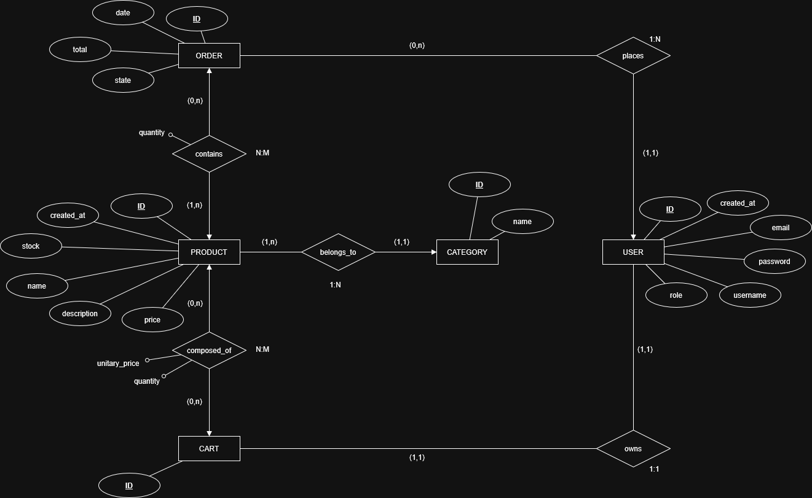
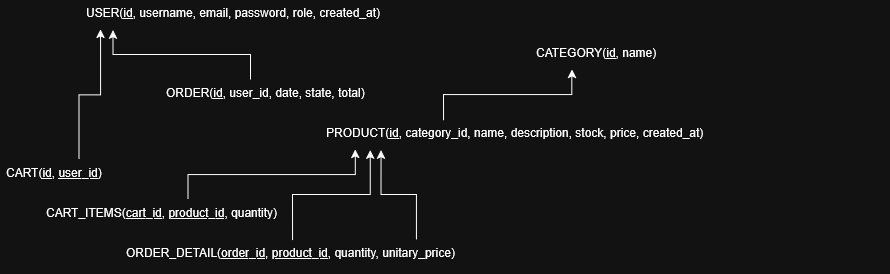

# Carpintería Online

## Descripción del proyecto

Este proyecto consiste en el desarrollo de una aplicación web para la gestión de pedidos y catálogo de productos de una carpintería. La plataforma permite la visualización de productos, gestión de usuarios, creación de pedidos y administración interna.

El sistema está diseñado siguiendo una arquitectura separada en frontend y backend, con comunicación mediante una API REST.

---

## Arquitectura 

El proyecto sigue una arquitectura desacoplada basada en servicios:

- **Frontend**: Interfaz de usuario desarrollada en React.
- **Backend**: API REST desarrollada con Django y Django REST Framework.
- **Servidor web**: Nginx como proxy inverso y servidor de archivos estáticos.
- **Base de datos**: PostgreSQL para almacenamiento persistente.

---

## Tecnologías utilizadas

### Backend
- Python
- Django
- Django REST Framework
- PostgreSQL

### Frontend
- React
- JavaScript 
- HTML5
- CSS3

### Infraestructura
- Nginx 
- Entorno virtual (venv)

---

## Estructura del backend

El backend sigue una arquitectura modular basada en apps de Django.

backend/ 
│ 
├── apps/ 
│ ├── users/ 
│ ├── products/ 
│ ├── orders/ 
│ ├── cart/ 
│ 
├── core/ 
│ ├── services/ 
│ 
├── config/  
├── manage.py 

---

## Arquitectura del backend

El backend está organizado en tres capas principales:

### 1. Models
Definen la estructura de la base de datos usando Django ORM.

Ejemplo:
- Product
- User
- Order
- Cart

---

### 2. Services
Capa intermedia donde se encapsula la lógica de negocio.

Ejemplo:
- `ProductService.create_product()`
- `ProductService.get_all_products()`

---

### 3. Views
Exposición de endpoints REST usando Django REST Framework.

Ejemplo:
- `ProductViewSet`
- `OrderViewSet`

---

## API REST

El backend expone una API REST consumida por el frontend React.

Ejemplo de endpoints:

GET /api/products/
POST /api/products/
GET /api/products/{id}/
PUT /api/products/{id}/
DELETE /api/products/{id}/

---

## Base de datos

La base de datos utilizada es PostgreSQL.

### Modelo entidad-relación

### Modelo relacional

---

## Autenticación

El sistema de autenticación se basa en Django Auth y está preparado para:

- Registro de usuarios
- Inicio de sesión
- Control de permisos

---

## Comunicación frontend-backend

La comunicación se realiza mediante HTTP requests a la API REST.

- Frontend (React) consume la API
- Backend responde en formato JSON
- Nginx actúa como intermediario en producción

---

## Estado actual del proyecto

✔ Estructura del backend definida  
✔ Modelos principales implementados  
✔ Servicios de lógica de negocio creados  
✔ API REST en desarrollo  
✔ Base de datos PostgreSQL configurada  
✔ Entorno preparado para integración con frontend  

---

## Próximos pasos

- Finalización de endpoints REST completos
- Integración con frontend React
- Configuración de Nginx en entorno de producción
- Autenticación con tokens (JWT)
- Tests del backend

---

## Autor

Proyecto desarrollado por Andrea Bushnell como parte del ciclo formativo de Desarrollo de Aplicaciones Web (DAW).
